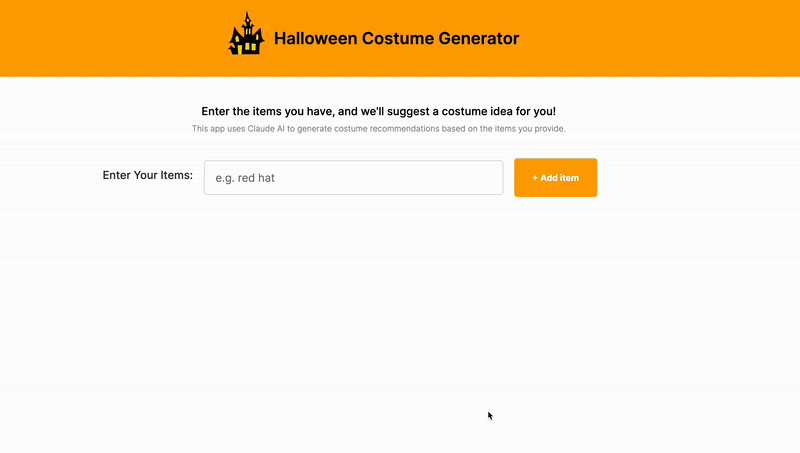

# Halloween Costume Generator

Hello, this is an app I made using Claude AI as a solo project after completing the first part of my React course. I used Javascript with the React framework. Hope you can find some cool costumes for yourself this year using this tool :)

To run it locally, first pull the github repository, cd into the folder "ai-website" and write these prompts in the command line:

```npm install```

```npm run dev```

Thank you for checking this project!


